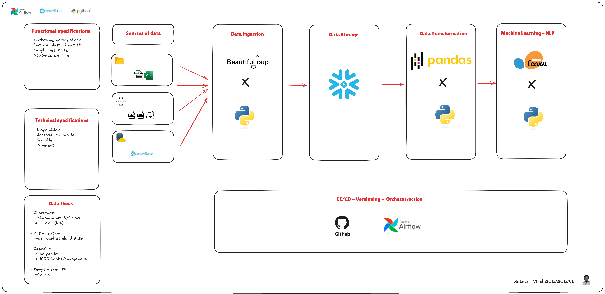

# <div style="text-align: center; background-color:#67001f; font-family:monospace; color: white; padding: 14px; line-height: 1;border-radius:20px">🕮 NLP Text Clustering & Web Scraping Project</div>


## <div style="text-align: left;background-color:#371de3; font-family:monospace; color: white; padding: 14px; line-height: 1; border-radius:10px"> Introduction 📚 </div>

Ce projet vise à scraper des données depuis le site [Books to Scrape](https://books.toscrape.com/), les transformer et les charger dans une base de données **Snowflake**. Par la suite, ces données sont utilisées pour entraîner un modèle de **clustering de texte** afin de classer les livres selon leur contenu textuel. Le projet est complété par un backend **FastAPI** pour exposer les résultats via une API REST.

## <div style="text-align: left;background-color:#371de3; font-family:monospace; color: white; padding: 14px; line-height: 1; border-radius:10px"> Architecture du Projet 🏗️ </div>



## <div style="text-align: left;background-color:#371de3; font-family:monospace; color: white; padding: 14px; line-height: 1; border-radius:10px"> Structure du dossier 📁 </div>

```plaintext
nlp-text-clustering-book-webscraping/
├── app/
│   ├── fastapi_backend.py      # Backend avec FastAPI
│   └── model/
│       ├── text_clustering.py  # Script de clustering
│       └── save/
│           ├── clustering_model.pkl  # Modèle de clustering sauvegardé
│           └── vectorizer.pkl        # Vectoriseur sauvegardé
├── config/
│   ├── ml_config.json          # Configuration du modèle ML
│   ├── scraping_config.json    # Configuration du scraping
│   └── snowflake_config.json   # Configuration de Snowflake
├── data/
│   ├── books_images_metadata/  # Dossier contenant les images scrappées
│   ├── src/                    # Autres fichiers source pour alimenter le modèle
│   ├── books_dataframe_cleaned.csv  # Données nettoyées
│   ├── books_images_metadata.json   # Métadonnées contenant les images
│   ├── clusters.csv            # Résultats du clustering
│   └── features.csv            # Caractéristiques vectorisées
├── scripts/
│   ├── snowflake_loader.py     # Script pour charger les données dans Snowflake
│   └── web_scraping.py         # Script pour le scraping
├── logs/                       # Journaux d'exécution
├── venv/                       # Environnement virtuel Python
├── README.md                   # Documentation du projet
├── roadmap_notebook.ipynb      # Fichier notebook pour test et différentes actions
└── requirements.txt            # Dépendances Python

```

## <div style="text-align: left;background-color:#371de3; font-family:monospace; color: white; padding: 14px; line-height: 1; border-radius:10px"> Objectifs 🎯 </div>

1. Scraper des données depuis **Books to Scrape**.
2. Construire et charger les données dans une base de données **Snowflake**.
3. Modéliser les données dans **Snowflake**.
4. Préparer les données pour le **clustering de texte**.
5. Entraîner un modèle de **clustering** avec **KMeans**.
6. Développer un backend **FastAPI** pour exposer les résultats.


## <div style="text-align: left;background-color:#371de3; font-family:monospace; color: white; padding: 14px; line-height: 1; border-radius:10px"> Configuration du Projet 🔧 </div>


###  <div style="text-align: left;background-color:#a197e6; font-family:monospace; color: white; padding: 14px; line-height: 1; border-radius:10px"> 1️⃣ Cloner le dépôt </div>

```bash
git clone https://github.com/your-repo/nlp-text-clustering-book-webscraping.git
cd nlp-text-clustering-book-webscraping
```
###  <div style="text-align: left;background-color:#a197e6; font-family:monospace; color: white; padding: 14px; line-height: 1; border-radius:10px"> 2️⃣ Configurer l'environnement virtuel </div>

```bash
python -m venv venv
source venv/bin/activate  # Sur Windows : venv\Scripts\activate
```
###  <div style="text-align: left;background-color:#a197e6; font-family:monospace; color: white; padding: 14px; line-height: 1; border-radius:10px"> 3️⃣ Installer les dépendances </div>

```bash
pip install -r requirements.txt
```

###  <div style="text-align: left;background-color:#a197e6; font-family:monospace; color: white; padding: 14px; line-height: 1; border-radius:10px"> 4️⃣ Configurer les fichiers </div>

Mettez à jour les fichiers de configuration dans `config/` :
- **scraping_config.json** : Configuration pour le scraping.
- **ml_config.json** : Hyperparamètres pour le modèle de clustering.
- **snowflake_config.json** : Informations de connexion Snowflake.

##  <div style="text-align: left;background-color:#371de3; font-family:monospace; color: white; padding: 14px; line-height: 1; border-radius:10px"> Résultats 📊</div>

- **Database** : Les données sont collectées via le site web, notoyées, scruturées et stockées dans Snowflake.
- **Clustering** : Les livres sont regroupés en clusters basés sur des caractéristiques textuelles.
- **Exposition API** :
  - Endpoint : `/clusters` → Retourne les clusters de livres.
  - Endpoint : `/predict` → Prédit le cluster d’un livre donné.

##  <div style="text-align: left;background-color:#371de3; font-family:monospace; color: white; padding: 14px; line-height: 1; border-radius:10px"> Outils Utilisés 🛠️</div> 

| Composant         | Description                                       |
|--------------------|---------------------------------------------------|
| **Python**         | Langage principal du projet.                     |
| **BeautifulSoup**  | Pour le scraping des données.                    |
| **Snowflake**      | Stockage et modélisation des données.            |
| **Scikit-learn**   | Entraînement du modèle de clustering.            |
| **FastAPI**        | Développement du backend REST.                   |
| **Uvicorn**        | Serveur ASGI pour FastAPI.                       |

---

##  <div style="text-align: left;background-color:#371de3; font-family:monospace; color: white; padding: 14px; line-height: 1; border-radius:10px"> Fonctionnalités 🛡️</div>  

- **Scraping** : Récupération des données depuis le web.
- **ETL** : Chargement des données dans Snowflake avec transformation.
- **Clustering** : Groupement des données textuelles.
- **API REST** : Interface pour interagir avec les résultats.

Pour toute question, et amélioration de ce projet n'hesitez pas à me contacter, Merci !

Auteur : Vital GUINGUINNI
